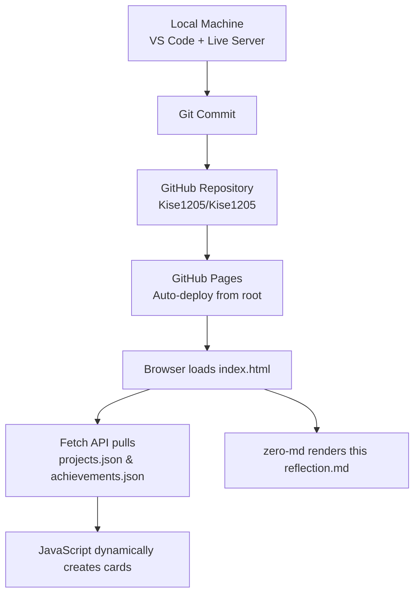

# Knowledge Reflection – CIS 376 Final Developer Profile  
**Thuan Nguyen** – Fall 2025

## Infrastructure – My Complete Tech Stack

> **IT Infrastructure**  
> “The set of hardware, software, networks, facilities, and services required for the development, operation, and management of an IT environment.”  
> — Gartner IT Glossary

My portfolio uses only **static infrastructure** (no server, no database):

| Layer              | Technology / Tool Used                                                                 |
|--------------------|----------------------------------------------------------------------------------------|
| Languages          | HTML5, CSS3, JavaScript (ES6+)                                                         |
| Framework          | Bootstrap 5.3                                                                          |
| Icons & Fonts      | Font Awesome 6, Google Fonts (Manrope)                                                 |
| Data               | JSON files (`data.json`, `achievements.json`)                                          |
| Networking         | **Fetch API** – modern replacement for XMLHttpRequest                                  |
| Rendering          | **zero-md** – client-side Markdown → HTML (https://github.com/zerodevx/zero-md)        |
| Hosting            | GitHub Pages (static hosting)                                                          |
| Version Control    | Git + GitHub                                                                           |
| Development        | VS Code, Chrome DevTools, Live Server extension                                        |
| Validation         | Nu HTML Checker, WAVE, Lighthouse                                                      |
| AI Assistance      | Grok (xAI) – code architecture, debugging, final polish                                |

> **Fetch API**  
> “A modern interface that provides a more powerful and flexible feature set for fetching resources. It is Promise-based and works seamlessly with async/await.”  
> — MDN Web Docs (https://developer.mozilla.org/en-US/docs/Web/API/Fetch_API)

## Architecture – How Everything Connects

**Development Process (Agile-inspired)**  
- Wireframed on paper → GitHub Issues as user stories → code locally → commit often → push → GitHub Pages auto-deploys  
- Used Issues, Labels, Milestones, and Assignees exactly like real dev teams

> **Agile Software Development**  
> “An iterative approach to project management and software development that helps teams deliver value to their customers faster and with fewer headaches. Instead of betting everything on a ‘big bang’ launch, an agile team delivers work in small, consumable increments.”  
> — Atlassian Agile Manifesto

## What I Wish I Knew on Day 1

1. **Never put content in HTML** – use JSON from the start. I wasted hours editing cards manually.
2. **Mobile-first is not optional** – 70% of recruiters will open your portfolio on their phone.
3. **Validate every single commit** – Nu + WAVE catch 95% of problems instantly.
4. **Relative paths break everything** – learn `./`, `../`, and root-relative `/` early.
5. **Lighthouse 100 is achievable** – lazy-load images, minify nothing, just write clean code.

## Final Takeaway to My Past Self

> “You don’t need React, Vue, or Node.js to impress employers in 2025.  
> Master semantic HTML, modern CSS, and vanilla JavaScript with the Fetch API.  
> A fast, accessible, data-driven static site beats a slow React app every single time.”

This final portfolio isn’t homework anymore — it’s the **real developer portfolio** I’ll send to jobs after graduation.

Thank you Dr. Cumbie for teaching us how to think like professionals, not just students.

**From Saigon → Florence, Alabama → wherever the code takes me next.**

— Thuan Nguyen  
December 2025
